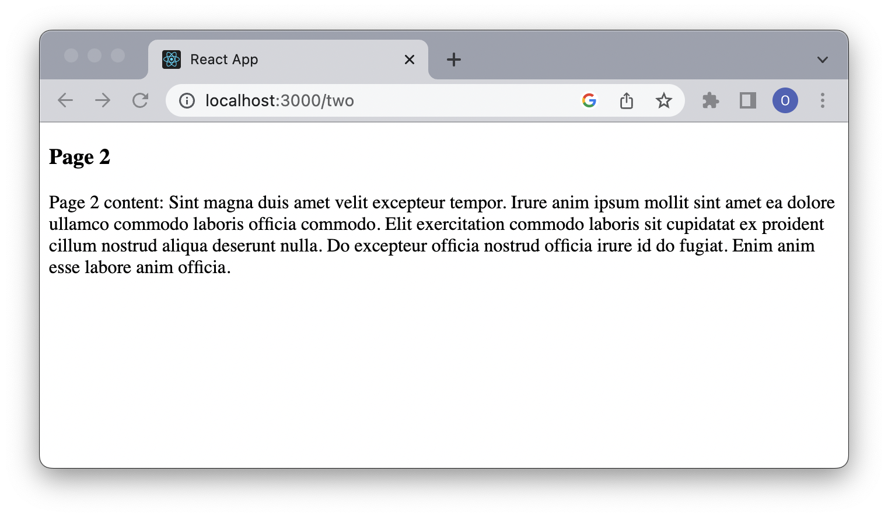

React Router — это решение для переключения и маршрутизации страниц React. React Router был одним из первых популярных проектов с открытым исходным кодом на основе React еще в 2014 году и вместе с React занял видное место в экосистеме React.

В этом руководстве по React Router мы рассмотрим ключевую концепцию библиотеки и разберем почему ее выбирают для организации маршрутизации. Напишем небольшое приложение c использованием хуков `useLocation` и `useNavigate`, и увидим как на практике работает маршрутизация, организованная с помощью это библиотеки. 

**Декларативная маршрутизация**

Декларативная маршрутизация — это стиль кодирования, используемый в React и React Router. Декларативные маршруты React являются компонентами и используют ту же инфраструктуру, что и любое приложение React.

Эти маршруты связывают веб-адреса с определенными страницами и другими компонентами, используя мощный механизм рендеринга React и условную логику для программного включения и выключения маршрутов. 

Конечно, любой маршрутизатор хорош настолько, насколько хороша его библиотека. React Router версии 6 предоставляет множество мощных функций для упрощения задач маршрутизации и является предпочтительным решением для маршрутизации React.

Что делает React Router лучшим по сравнению с другими библиотеками маршрутизации:
- Декларативное определение маршрута (с использованием JSX внутри компонентов React)
- Отраслевой стандарт
- Предлагает множество примеров кода и онлайн-руководство
- Предоставляет возможность использования хуков и функциональных компонентов

Текущая версия React Router v6 внесла ряд ключевых изменений по сравнению с предыдущей версией 5:

- Компонент `<Switch>` был переименован в `<Routes>`.
- Хук `useRoutes()` заменяет react-router-config для определения маршрутов как простых объектов.
- Каждый дочерний компонент `<Routes>` должен быть `<Route>`, что может нарушить некоторые предыдущие методы организации и составления маршрутов.

Далее в статье все примеры будут построены c использованием React Router версии 6. Чтобы узнать больше об обновлении с версии 5 до версии 6, можно ознакомиться с [официальным руководством по миграции](ttps://reactrouter.com/en/main/upgrading/v5).

**Подготовка окружения**

Прежде чем мы приступим к практике, необходимо подготовить рабочее окружение. 

Для создания веб-приложений нам нужен `react-router-dom`, который включается в себя все, что есть в `react-router`, и добавляет несколько специфичных для `DOM API` компонентов, включая `<BrowserRouter>` и `<Link>`.

Создадим проект с помощью `Create React App` и установим `react-router-dom`:

```bash
npx create-react-app my-app
cd my-app
npm i react-router-dom
```

Кроме того, установим [lorem-ipsum](https://github.com/knicklabs/lorem-ipsum.js) для генерации текста-заполнителя `lorem ipsum` для страниц. 

```bash
npm i lorem-ipsum
```

Теперь пакеты `react-router-dom` and `lorem-ipsum` можно увидеть in package.json в качестве зависимостей.


**Настройка маршрутов**


Router — это компонент верхнего уровня с отслеживанием состояния, который заставляет работать все остальные компоненты навигации и хуки. В React Router есть `BrowserRouter`, `HashRouter`, `StaticRouter`, `NativeRouter` и `MemoryRouter`. Для веб-приложений обычно используется `BrowserRouter`. Приложение должно иметь один `<BrowserRouter>`, который обертывает один или несколько `<Routes>`.

`<Routes>` проверяет все свои дочерние элементы `<Route>`, чтобы найти наилучшее соответствие, и отображает эту часть пользовательского интерфейса.

`<Route>` можно определить либо как объект, либо элемент Route. Если это объект, объект имеет форму `{ path, element }`. Если это элемент Route, компонент имеет вид `<Route path element>`. Когда указанный путь (`path`) соответствует текущему URL-адресу, отображается компонент, указанный в качестве элемента (`element`). В нашем приложении вы будем использовать элементы.

Подготовим несколько страниц, для которых будем настраивать маршрутизацию:

```JSX
// src/Components/Pages.jsx
import { loremIpsum } from 'lorem-ipsum';

const BuildPage = (index) => (
  <>
    <h3>Page {index}</h3>
    <div>
      Page {index} content: { loremIpsum({ count: 5 })}
    </div>
  </>
);

export const PageOne = () => BuildPage(1);
export const PageTwo = () => BuildPage(2);
```

В `src/App.js` создадим два маршрута:

```jsx
// App.jsx
import { BrowserRouter, Routes, Route } from 'react-router-dom';
import { PageOne, PageTwo } from './Components/Page';

function App() {
  return (
    <BrowserRouter>
      <Routes>
        <Route path='one' element={<PageOne />} />
        <Route path="two" element={<PageTwo />} />
      </Routes>
    </BrowserRouter>
  );
}

export default App;
```

В коде выше `<BrowserRouter>` и `<Routes>` используются для определения маршрутизатора. 

В приложении есть два `<Route>`. Когда URL-адрес соответствует пути 'one', приложение показывает компонент `PageOne`. Когда URL-адрес соответствует пути 'two', приложение показывает компонент `PageTwo`.

Запустим приложение, выполнив команду `npm start`.

`http://localhost:3000/one` показывает PageOne.


`http://localhost:3000/two` показывает PageTwo.


Приложение работает для путей "one" и "two". `Однако http://localhost:3000` ничего не показывает, как и любые недействительные URL-адреса, такие как `http://localhost:3000/anything`.

Эту проблему можно решить с помощью подстановочного пути:

```jsx
// App.jsx
import { BrowserRouter, Routes, Route } from 'react-router-dom';
import { PageOne, PageTwo } from './Components/Page';

function App() {
  return (
    <BrowserRouter>
      <Routes>
        {/* подстановочный путь */}
        <Route path="*" element={<PageOne />} />
        <Route path="two" element={<PageTwo />} />
      </Routes>
    </BrowserRouter>
  );
}

export default App;
```

Теперь` http://localhost:3000/two` показывает `PageTwo`. Во всех остальных случаях будет отображаться `PageOne`.
Порядок указания маршрутов не имеет значения, так как React Router 6 выбирает в первую очередь наиболее точное совпадение. 


**Настройка вложенных маршрутов**


Два маршрута в приведенном выше примере работают, как и ожидалось. Однако вводить URL-адрес в адресной строке браузера неудобно. Мы хотели бы иметь возможность навигации по ссылке, которая называется `<Link>`.

`<Link>` отображает доступный элемент `<a>` с реальным `href`, указывающим на ресурс, на который он ссылается. Клик по ссылке устанавливает URL-адрес и отслеживает историю просмотров.

Создадим главную страницу, которая будет содержать ссылки `<Link>` на соответствующие страницы `src/MainPage.js` 

```jsx
// src/MainPage.js
import { Link } from 'react-router-dom';

export const MainPage = () => (
  <nav>
    <ul>
      <li>
        <Link to="/one">Page One</Link>
      </li>
      <li>
        <Link to="/two">Page Two</Link>
      </li>
    </ul>
  </nav>
);
```
Добавим главную страницу в наше приложение и отметим эту страницу как индексный маршрут , который является дочерним маршрутом без пути. 

```jsx
import {
  BrowserRouter,
  Routes,
  Route,
} from 'react-router-dom';
import { PageOne, PageTwo } from './Components/Pages';
import MainPage from './Components/MainPage';

const App = () => {

  return (
    <BrowserRouter>
      <Routes>
          <Route path="/" element={<MainPage/> } />
          <Route path="one" element={<PageOne />} />
          <Route path="two" element={<PageTwo />} />
      </Routes>
    </BrowserRouter>
  );
}

export default App;
```

Теперь, когда URL-адрес соответствует «/», приложение будет показывать `MainPage`:


Нажав на ссылку `Page One`, мы перейдем на `PageOne`. Нажав на ссылку `Page Two`, мы перейдете на `PageTwo`.

Однако внутри `PageOne` или P`ageTwo` мы не можем использовать ссылки для навигации. Чтобы решить эту проблему, мы создаем компонент `<Outlet>` в `MainPage`. 

`<Outlet>` позволяет отображать вложенный пользовательский интерфейс при отображении дочерних маршрутов. Таким образом, при клике на 'one' будет отображаться компонент `PageOne`, при клике на 'two' - `PageTwo`. 

Это `src/MainPage.js` с Outlet:

```jsx
import React from 'react';
import { Link, Outlet } from 'react-router-dom';

const MainPage = () => {
  return (
    <>
      <nav>
        <ul>
          <li>
            <Link to='/one'>Page One</Link>
          </li>
          <li>
            <Link to='/two'>Page Two</Link>
          </li>
        </ul>
      </nav>
      <hr />
      <Outlet />
    </>
  )
};
```

`<Outlet>` вызывает вложенные маршруты, где у каждого маршрута могут быть дочерние маршруты, занимающие часть URL-адреса. Вложенные маршруты обычно описывают через относительные ссылки.

Вот модифицированный `src/App.js`:
```jsx
import { BrowserRouter, Routes, Route } from 'react-router-dom';
import { PageOne, PageTwo } from './Components/Page';
import MainPage from './Components/MainPage';

const App = () => {

  return (
    <BrowserRouter>
      <Routes>
        <Route path="/" element={<MainPage />} >
          <Route index element={<div>No page is selected.</div> } />
            <Route path="one" element={<PageOne />} />
            <Route path="two" element={<PageTwo />} />
          </Route>
      </Routes>
    </BrowserRouter>
  );
}
```
`http://localhost:3000/` теперь выглядит так:


А это `http://localhost:3000/one`:


**Хук useLocation**


Местоположение — это объект, который представляет местоположение URL. Он основан на объекте браузера window.location.

Хук `useLocation` возвращает объект текущего местоположения.

```jsx
import React, { useEffect } from 'react';
import { Link, Outlet, useLocation } from 'react-router-dom';

const MainPage = () => {
  const location = useLocation();

  useEffect(() => {
    console.log('Current location is ', location);
  }, [location]);

  return (
    <>
      <nav>
        <ul>
          <li>
            <Link to="/one">Page One</Link>
          </li>
          <li>
            <Link to="/two">Page Two</Link>
          </li>
        </ul>
      </nav>
      <hr />
      <Outlet />
    </>
  );
};
```
В переменную `location` сохраняем местоположение, которое генерируется хуком `useLocation`.

Внутри хука `useEffect` будем выводить текущее местоположение при каждом изменении параметра `location`.

Если URL-адрес `http://localhost:3000/`, консоль регистрирует:

> Current location is {pathname: '/', search: '', hash: '', state: null, key: 'default'}

Если URL-адрес `http://localhost:3000/one`, консоль регистрирует:

> Current location is {pathname: '/one', search: '', hash: '', state: null, key: 'f2114bru'}

Когда URL-адрес `http://localhost:3000/anything`, консоль регистрирует:
 
> Current location is {pathname: '/anything', search: '', hash: '', state: null, key: 'default'}


**Хук useNavigate**


Хук `useNavigate` возвращает функцию, которую можно использовать для программной навигации. Заменим все `<Link>` в нашем приложении на `<button>` в `src/MainPage.js`:


```jsx
import React, { useEffect } from 'react';
import { Outlet, useLocation, useNavigate } from 'react-router-dom';

const MainPage = () => {
  const location = useLocation();
  const navigate = useNavigate();

  useEffect(() => {
    console.log('Current location is ', location);
  }, [location]);

  return (
    <>
      <nav>
        <ul>
          <li>
            <button onClick={() => navigate('one', { replace: false })}>
              Page One
            </button>
          </li>
          <li>
            <button onClick={() => navigate('two', { replace: false })}>
              Page Two
            </button>
          </li>
        </ul>
      </nav>
      <hr />
      <Outlet />
    </>
  )
};
```

Теперь запустим наше приложение и убедимся, что кнопки работают аналогично ссылкам. 


Хук `useNavigate` может принимать :
- либо значение `To` также как и в `<Link to>` с необязательным вторым аргументом `{ replace, state }`.
- либо дельта-число, чтобы войти в стек истории. Например, навигация (-1) эквивалентна нажатию кнопки «Назад».


**Прочие Хуки**


Мы показали, как использовать `useLocation`, `useNavigate`. Есть и другие хуки React Router (например, `useParams` and `useRoutes` и т.д.), с которым можно ознакомиться в официальной документации [React Router](https://reactrouter.com/en/main)


**Заключение**


У React Router версии 6 богатая функциональность, он достаточно прост в использовании, а также совместим с последними версиями React.
Мы рассмотрели основы маршрутизации на основе этой библиотеки, познакомились с ее основными компонентами и хуками. Написали небольшое приложение, чтобы посмотреть на основные концепции React Router на практике. 